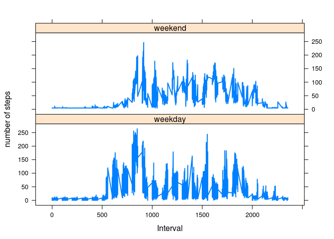

# Preprocessing the data

It is assumed that the data is downloaded into the current working directory.


```r
raw_activity <- read.csv("activity.csv", stringsAsFactors = FALSE)
```

Cleaning up the data 

```r
raw_activity$date <- as.POSIXct(raw_activity$date, format = "%Y-%m-%d")

raw_activity <- data.frame(date = raw_activity$date, weekday = tolower(weekdays(raw_activity$date)),steps = raw_activity$steps, interval = raw_activity$interval)

raw_activity <- cbind(raw_activity, daytype = ifelse(raw_activity$weekday == "saturday" | raw_activity$weekday == "sunday", "weekend", "weekday"))

activity <-data.frame(date = raw_activity$date, weekday = raw_activity$weekday, daytype = raw_activity$daytype, interval = raw_activity$interval, steps = raw_activity$steps)
```

#What is the mean total number of steps taken per day?


```r
# histogram
tot <- aggregate(activity$steps, by = list(activity$date), FUN = sum, na.rm = TRUE)

names(tot) <- c("date", "total")

hist(tot$total,
     breaks = seq(from = 0, to = 25000, by = 2500),
     col = "blue",
     xlab = "Total number of steps",
     ylim = c(0, 20 ),
     main = " Hist of total num of steps")
```

<!-- -->

Mean number of steps


```r
mean_tot <- mean(tot$total)
median_tot <- median(tot$total)
```
Mean and Median are 9354.2295082 and 10395 respectively.

#What is the average daily activity pattern?


```r
avg_data <- aggregate(activity$steps,
                      by = list(activity$interval),
                      FUN = mean,
                      na.rm = TRUE)

names(avg_data ) <- c("interval", "mean")

plot(avg_data$interval,
     avg_data$mean,
     type = "l",
     col = "blue",
     lwd = 2,
      xlab = "Interval in minutes",
     ylab = "average number of steps",
     main = "Time series plot ")
```

<!-- -->

The 5-minute interval that contains the maximum number of steps


```r
max_steps <- which(avg_data$mean == max(avg_data$mean))

interval <- avg_data[max_steps, 1]
```
The five minute interval that contains the maximum number of steps is 835.

#Impute the missing values


```r
#number of NA values
num_na <- sum(is.na(activity$steps))
```
Number of 'NA's is 2304.


```r
# position of na values
na_pos <- which(is.na(activity$steps))
mean_vec <- rep(mean(activity$steps, na.rm = TRUE), times = length(na_pos))
```

Filling in the missing values

```r
activity[na_pos, "steps"] <- mean_vec
```

Show the head of the new activity dataset

```r
head(activity)
```

```
##         date weekday daytype interval   steps
## 1 2012-10-01  monday weekday        0 37.3826
## 2 2012-10-01  monday weekday        5 37.3826
## 3 2012-10-01  monday weekday       10 37.3826
## 4 2012-10-01  monday weekday       15 37.3826
## 5 2012-10-01  monday weekday       20 37.3826
## 6 2012-10-01  monday weekday       25 37.3826
```
mean and median calculated for the new imputed data set

```r
tot_data <- aggregate(activity$steps , by = list(activity$date), FUN = sum)

names(tot_data) <- c("date", "total")

hist(tot_data$total,
     breaks = seq(from = 0, to = 25000, by = 2500),
     col = "blue",
     xlab = "Total number of steps",
     ylim = c(0, 30),
     main = " Histogram of the total number of steps taken each day when NA are replaced by mean values")
```

<!-- -->

Mean and median values

```r
tot_mean1 <- mean(tot_data$total)
tot_median1 <- median(tot_data$total)
```

New mean and median values are 1.0766189\times 10^{4} and 1.0766189\times 10^{4} respectively.

These values differ from the ones calculated earlier.

# Are there differencese in activity patterns between weekdays and weekends?


```r
library(lattice)

mean_data <- aggregate(activity$steps,
                       by = list(activity$daytype,
                                 activity$weekday,
                                 activity$interval), mean)

names(mean_data) <- c("daytype", "weekday", "interval", "mean")
```

The time series plot

```r
xyplot(mean ~interval |daytype, mean_data,
       type = "l",
       lwd = 2,
       xlab = "Interval",
       ylab = "number of steps",
       layout = c(1,2))
```

<!-- -->

}
